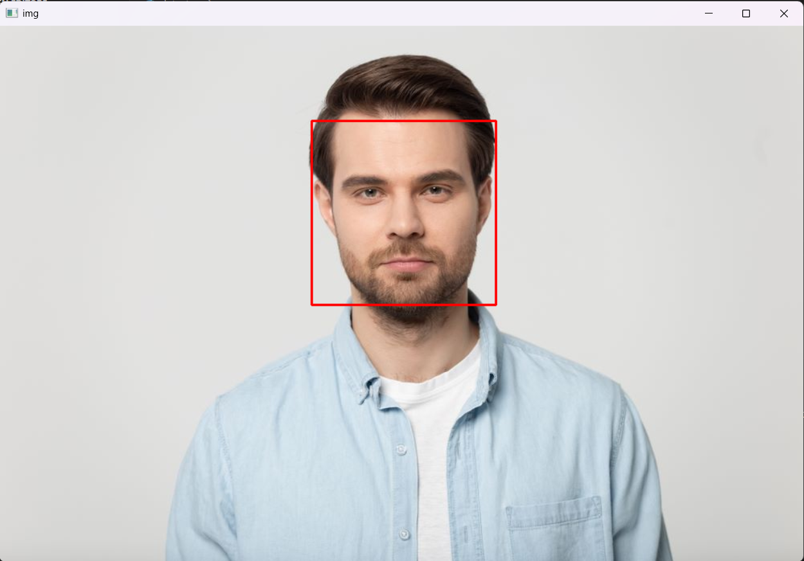

# OpenCV ile Yüz Algılama Projesi

Bu proje, bir görüntü veya fotoğraf üzerindeki insan yüzlerini tespit etmek için OpenCV kütüphanesini ve Haar Cascade sınıflandırıcısını kullanan basit bir Python uygulamasıdır.

## Projenin Amacı

Bu projenin temel amacı, OpenCV'nin `cv2.CascadeClassifier` fonksiyonunu kullanarak önceden eğitilmiş bir model (`haarcascade_frontalface_default.xml`) aracılığıyla yüz tespitinin nasıl yapılacağını göstermektir.

## Örnek Çıktı

Proje çalıştığında, `data.png` dosyasındaki yüzü aşağıdaki gibi kırmızı bir dikdörtgen içine alır:



## Gereksinimler

Projeyi çalıştırmak için aşağıdaki kütüphanelerin yüklü olması gerekmektedir:

* `opencv-python`
* `numpy`

Bu gereksinimler `requirements.txt` dosyasında listelenmiştir.

## Kurulum

Projeyi yerel bilgisayarınızda kurmak için aşağıdaki adımları izleyin:

1.  **Repoyu klonlayın (veya indirin):**
    ```bash
    git clone (https://github.com/aybukezehra/opencv-face-detection.git)
    ```

2.  **(Tavsiye Edilir) Bir sanal ortam (virtual environment) oluşturun:**
    ```bash
    python -m venv venv
    ```

3.  **Sanal ortamı aktifleştirin:**
    * Windows (PowerShell):
        ```powershell
        .\venv\Scripts\Activate.ps1
        ```
    * Linux/macOS:
        ```bash
        source venv/bin/activate
        ```

4.  **Gerekli kütüphaneleri yükleyin:**
    ```bash
    pip install -r requirements.txt
    ```

## Kullanım

Kurulum tamamlandıktan sonra, script'i çalıştırmak için aşağıdaki komutu terminalinize yazın:

```bash
python detect.py
